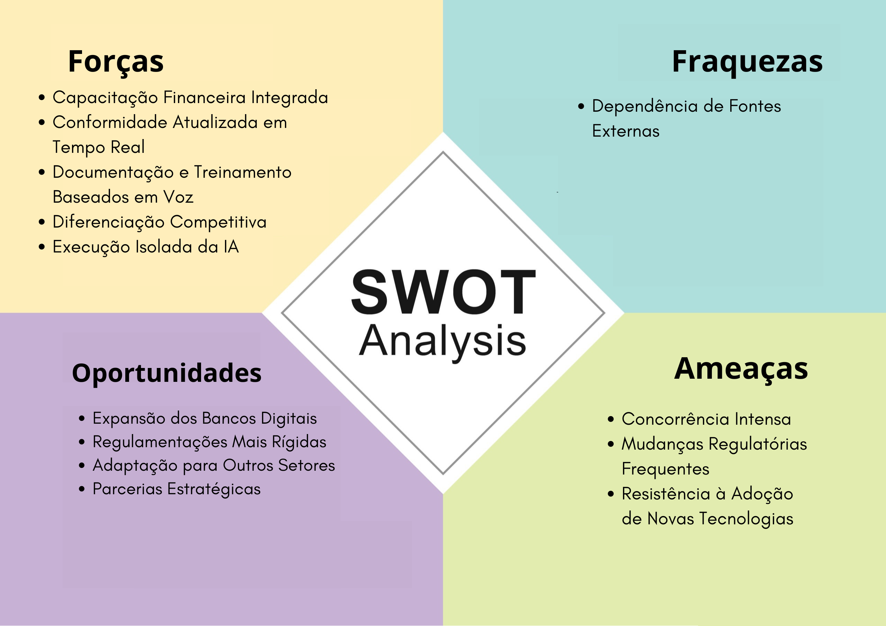
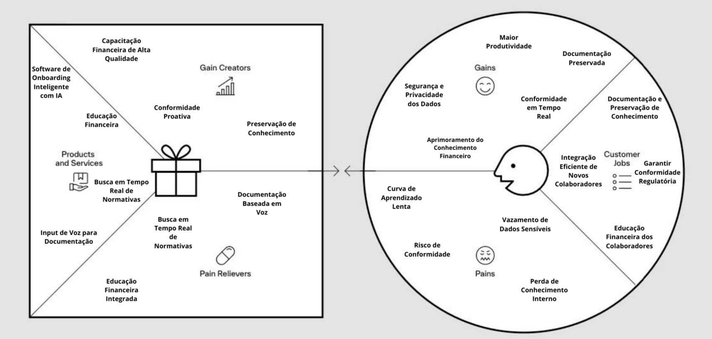
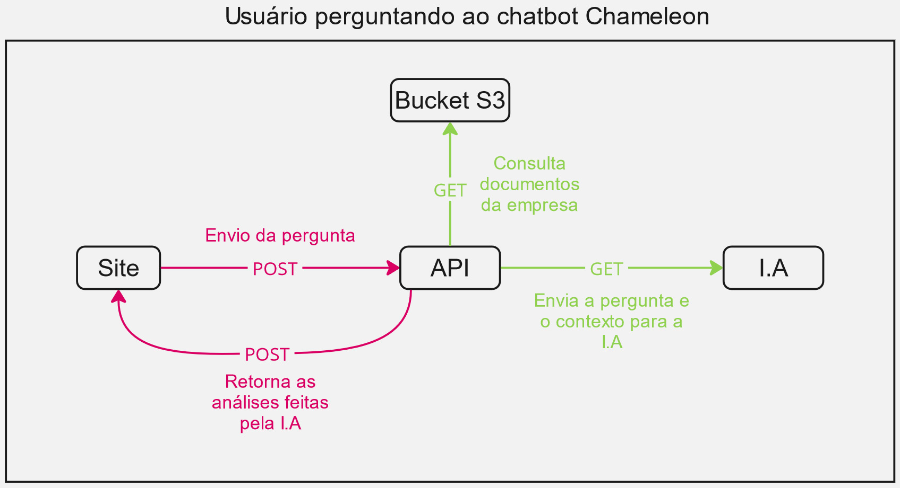
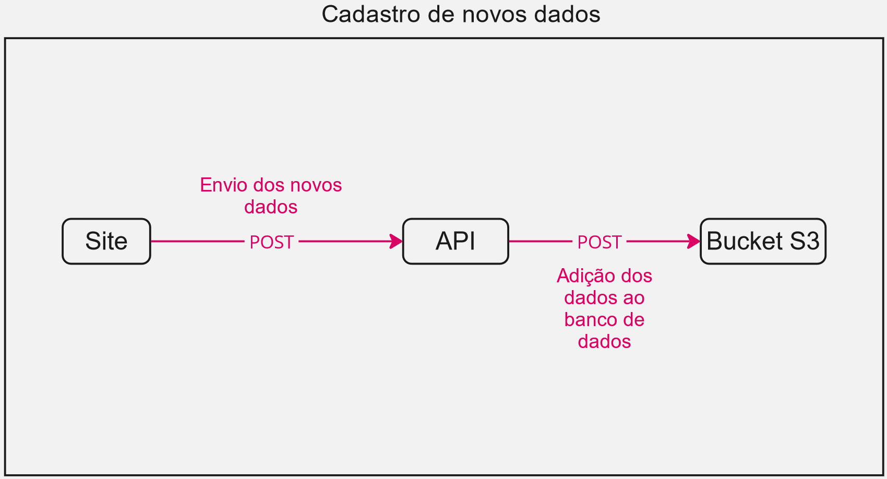
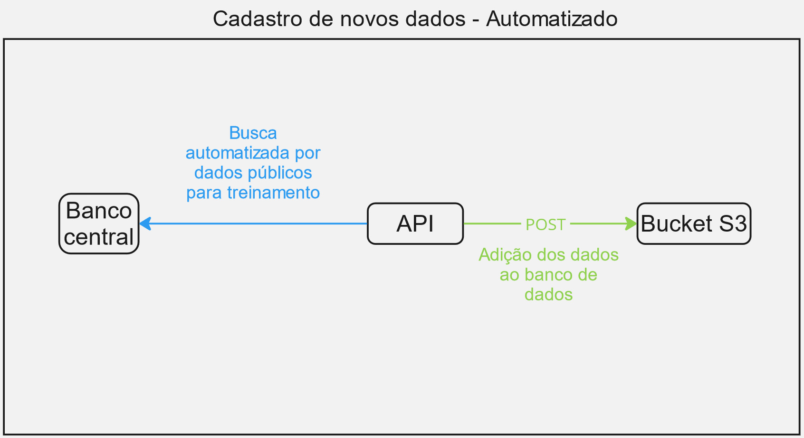
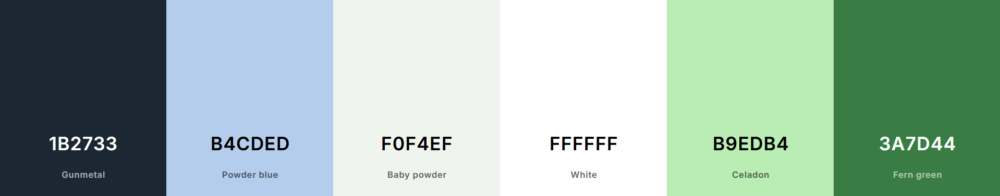

# Chameleon

🧠 A solução consiste em um chatbot capaz de capacitar o conhecimento de mercado financeiro entre os colaboradores de uma instituição bancária de forma personalizada.

⚙️ Solução desenvolvida usando ReactJS, Tailwind CSS e Python

## Índice

- 🌐[Cenário Geral](#cenário-geral): Uma perspectiva das altas tranformações que o mercado de trabalho sofreu nas últimas décadas.
- 🎯[Nossa Ideia](#nossa-ideia): A partir da perspectiva geral, como pretendemos promover a educação financeira entre os colaboradores de uma instituição bancária.
- 📈[Análise de Mercado](#análise-de-mercado): Entendendo a falta de conhecimento financeiro por pessoas que ingressam em uma instituição bancárias e como podemos proporcionar o conhecimento técnico financeiro dos colaboradores
- 💻[Detalhamento de Tecnologias](#detalhamento-de-tecnologias): Uma visão mais aprofundada das tecnologias utilizadas no desenvolvimento do projeto.
- 📍[Planos Futuros](#planos-futuros): Uma prospecção de como podemos melhorar a nossa proposta.
- 😀[Nossa Equipe](#nossa-equipe): Conheça os nossos membros.

## 🌐Cenário Geral

&ensp;O mercado de trabalho atual, especialmente no setor de tecnologia, está passando por uma transformação significativa, marcada por uma alta turnover (rotatividade de colaboradores) de colaboradores. Em um ambiente onde a demanda por profissionais qualificados supera a oferta, empresas de todos os setores, incluindo o mercado financeiro, enfrentam o desafio de atrair e reter talentos. A rápida mudança de emprego por parte desses profissionais, que frequentemente buscam melhores oportunidades, resulta em períodos curtos de permanência nas empresas, criando uma dinâmica desafiadora para a continuidade e o sucesso dos projetos.

&ensp;No setor de tecnologia, a rotatividade de colaboradores tornou-se uma realidade constante. Profissionais da área tech são altamente valorizados e, devido à escassez de talentos, têm à sua disposição diversas oportunidades de emprego, muitas vezes com propostas mais atraentes em termos de remuneração, benefícios e flexibilidade. Essa competição acirrada entre as empresas faz com que os profissionais mudem de emprego com mais frequência, o que, por sua vez, impacta diretamente a estabilidade das equipes e o andamento dos projetos.

&ensp;No mercado financeiro, onde a precisão, a conformidade com regulamentações e a segurança da informação são fundamentais, a alta rotatividade na área tech pode ter consequências ainda mais significativas. Projetos críticos, que exigem um profundo entendimento dos processos internos, dos termos financeiros e das normativas regulatórias, podem ser prejudicados pela constante entrada e saída de colaboradores. Além disso, a necessidade de integrar rapidamente novos membros às equipes e garantir que eles compreendam o contexto e os objetivos dos projetos em andamento torna o processo de onboarding ainda mais crucial.

&ensp;Um aspecto frequentemente negligenciado, mas vital, é a **educação financeira dos colaboradores**. Muitos profissionais, especialmente aqueles que não vêm de uma formação financeira, ingressam no mercado financeiro sem o conhecimento necessário para compreender plenamente os produtos e serviços que promovem, os riscos associados ou as regulamentações que precisam seguir. Sem uma educação financeira adequada durante o onboarding, esses colaboradores podem enfrentar dificuldades significativas, comprometendo sua eficiência e aumentando o risco de erros operacionais.

&ensp;A falta de **educação financeira** não afeta apenas áreas operacionais e de compliance, mas também impacta a **employee experience**. Colaboradores que não entendem os fundamentos financeiros podem se sentir inseguros em suas funções, o que diminui a satisfação no trabalho e pode contribuir para uma maior rotatividade. Além disso, áreas como marketing e vendas também são afetadas. Profissionais de marketing precisam compreender os produtos financeiros que promovem, bem como as regulamentações que governam a comunicação dessas ofertas. Sem essa compreensão, campanhas podem ser mal direcionadas ou até mesmo não conformes com as normas regulatórias.

&ensp;Por fim, o mercado financeiro está sujeito a constantes atualizações e mudanças nas regulamentações, frequentemente impostas por normativas de órgãos como o Banco Central. A capacidade de manter os colaboradores informados e em conformidade com as últimas normativas é essencial para evitar penalidades e garantir a segurança das operações. Nesse contexto, soluções de onboarding que não apenas integram novos colaboradores, mas também fornecem **educação financeira** e acesso em tempo real às regulamentações mais recentes são fundamentais.

&ensp;Este cenário de alta rotatividade, constante mudança de equipes e evolução regulatória coloca uma pressão adicional sobre as empresas para que revisem e aprimorem seus processos de integração. Sem um onboarding eficiente e atualizado, que inclua a educação financeira, os novos colaboradores podem levar mais tempo para se adaptar, comprometendo a produtividade, a conformidade e a **employee experience** em diversas áreas da empresa. Em um mercado tão dinâmico e competitivo como o financeiro, a capacidade de integrar, educar e reter talentos de forma eficaz, enquanto se mantém em conformidade com as regulamentações mais recentes, é muito importante para o sucesso a longo prazo.
## 🎯Nossa ideia
## O problema

&ensp;No mercado financeiro, onde a complexidade e a regulamentação são fundamentais, a integração eficaz de novos colaboradores é um desafio crítico. Muitos profissionais, especialmente aqueles que ingressam na área sem uma formação sólida em finanças, enfrentam dificuldades significativas para entender os produtos financeiros, as regulamentações e os processos internos. Essa falta de preparo não só retarda a adaptação dos novos colaboradores, mas também aumenta o risco de erros operacionais e falhas na conformidade regulatória.

&ensp;Além disso, a alta rotatividade na área de tecnologia intensifica esses desafios, já que novos colaboradores precisam ser integrados rapidamente em projetos críticos, muitas vezes sem o conhecimento necessário para compreender plenamente o ambiente financeiro. Sem um processo de onboarding que aborde essas lacunas, a produtividade é comprometida e a conformidade com as regulamentações torna-se uma preocupação constante.

&ensp;Outro aspecto crítico é a necessidade de manter os colaboradores atualizados com as frequentes mudanças nas normativas do setor financeiro. As regulamentações impostas por órgãos como o Banco Central são complexas e estão em constante evolução. Sem uma forma eficiente de acessar e entender essas normativas em tempo real, os colaboradores podem inadvertidamente operar fora de conformidade, colocando a instituição em risco.

&ensp;Portanto, o problema central é a falta de um processo de onboarding que não apenas integre novos colaboradores, mas também forneça educação financeira e acesso atualizado às normativas relevantes. Resolver esse problema é essencial para garantir que os colaboradores sejam produtivos, conformes com as regulamentações e capazes de contribuir efetivamente para o sucesso contínuo das operações financeiras.

## A solução

&ensp;A solução que está sendo desenvolvida é um software inovador voltado para a educação financeira dos colaboradores no setor bancário, oferecendo um conjunto abrangente de funcionalidades que atendem às necessidades críticas de educação econômica, conformidade com normativas do Banco Central, documentação e onboarding de colaboradores recentes.

- **1. Conformidade com Normativas e Atualizações do Mercado:**
&ensp;O software oferece uma capacidade única de realizar buscas em tempo real das normativas do Banco Central, assegurando que os colaboradores estejam sempre atualizados com as mais recentes regulamentações de compliance. Além disso, ele captura e apresenta normativas e tendências que o mercado está lançando, fornecendo aos colaboradores as informações necessárias para agregar mais valor à empresa e garantir que as operações estejam sempre em conformidade com os padrões regulatórios mais atuais.

- **2. Educação Financeira para Colaboradores:**
&ensp;O principal pilar desta solução é a educação financeira dos colaboradores. O chatbot possui a capacidade de saciar dúvidas desde conceitos financeiros básicos até tópicos mais avançados e personalizados de acordo com os serviços e produtos oferecidos pela a empresa contratante, permitindo que todos os funcionários, independentemente de sua formação prévia, compreendam os produtos financeiros, as regulamentações e os riscos associados às suas funções. Essa abordagem melhora a confiança e a eficácia dos colaboradores, reduzindo a curva de aprendizado e o risco de erros operacionais.

- **3. Input de Voz para Documentação e Treinamento:**
&ensp;Uma característica diferenciada do software é o input de voz, que permite que colaboradores experientes documentem processos internos e conhecimentos específicos dos serviços prestados pela empresa, que anteriormente não estavam documentados, estavam apenas guardados nas memórias de algumas pessoas. Esses áudios são processados para gerar documentos que não apenas preservam o conhecimento institucional, mas também contribuem diretamente para a educação financeira dos colaboradores e o seu entendimento dos processos internos e dos serviços oferecidos. Esses documentos são utilizados para treinar o chatbot do software, garantindo que esse conhecimento  seja acessível a todos os funcionários, fortalecendo tanto a formação financeira quanto o domínio dos procedimentos operacionais.

- **4. Diferenciais Comparados a Soluções como Hacker Rangers:**
&ensp;Ao contrário de soluções como o Hacker Rangers, que podem focar em aspectos mais técnicos de segurança e conformidade, este software se destaca ao integrar profundamente a educação financeira no processo de onboarding e treinamento contínuo dos colaboradores. Além disso, a capacidade de capturar, documentar e transformar em aprendizado os processos internos através de input de voz é uma inovação que assegura que o conhecimento crítico contribua para o desenvolvimento contínuo dos colaboradores, melhorando sua compreensão dos serviços e processos da empresa.

- **Vantagens para a Empresa:**
&ensp;A adoção deste software traz múltiplas vantagens para a empresa. Além de melhorar a conformidade regulatória e a educação financeira dos colaboradores, ele oferece uma maneira eficaz de documentar e preservar conhecimento institucional que, de outra forma, poderia ser perdido. Isso resulta em uma força de trabalho mais informada, produtiva e capaz de agregar valor de maneira consistente. A solução também facilita a integração e o treinamento de novos colaboradores, assegurando que todos estejam alinhados com as melhores práticas e com as regulamentações do mercado financeiro.

&ensp;Em resumo, este software é uma ferramenta essencial para qualquer instituição financeira que busca fortalecer a educação financeira de seus colaboradores, garantir a conformidade com normativas em constante evolução, e preservar o conhecimento crítico dentro da empresa. Com suas funcionalidades inovadoras, ele se posiciona como uma solução completa e diferenciada no mercado.

COMO FIZEMOS ISSO?: [DESCREVER PARTE TÉCNICA]

# 📈Análise do mercado

## Análise SWOT:
&ensp;A Análise SWOT é uma ferramenta estratégica usada para identificar e avaliar os **Pontos Fortes (Strengths)**, **Pontos Fracos (Weaknesses)**, **Oportunidades (Opportunities)** e **Ameaças (Threats)** de uma empresa, projeto ou situação. Ela ajuda a entender as vantagens competitivas internas (forças) e os desafios internos (fraquezas), bem como as condições externas favoráveis (oportunidades) e os riscos (ameaças) que podem impactar o sucesso. Através dessa análise, as organizações podem desenvolver estratégias mais informadas para aproveitar seus pontos fortes, mitigar suas fraquezas, explorar oportunidades e proteger-se contra ameaças. Dado essa importância, segue a análise SWOT da Chamaleon na Figura 1:

 Figura 1: Análise SWOT 
 

 
 Fonte: Material produzido pelos autores (2024) 

**Forças (Strengths):**

1. **Capacitação Financeira Integrada:** O chatbot oferece capacidades abrangentes para o desenvolvimento do conhecimento financeiro dos colaboradores, garantindo que todos, independentemente de sua formação prévia, adquiram uma compreensão sólida dos conceitos financeiros e das regulamentações do setor.
2. **Conformidade Atualizada em Tempo Real:** A funcionalidade de busca em tempo real das normativas do Banco Central e das novas regulamentações do mercado financeiro mantém os colaboradores informados e em conformidade com as mais recentes exigências regulatórias.
3. **Documentação e Treinamento Baseados em Voz:** O recurso de input de voz permite capturar e documentar processos internos que anteriormente não eram formalmente registrados, transformando o conhecimento tácito em recursos acessíveis que fortalecem a compreensão dos serviços e procedimentos internos.
4. **Diferenciação Competitiva:** Em comparação com soluções como o Hacker Rangers, este software se diferencia por focar não apenas na conformidade técnica, mas também no aprimoramento do conhecimento financeiro e na preservação do conhecimento institucional.
5. **Execução Isolada da IA:** A inteligência artificial do software roda em uma instância da nuvem em um ambiente protegido, eliminando riscos de vazamento de dados e garantindo que as informações sensíveis dos colaboradores e da empresa não sejam comprometidas. Além disso, o software não realiza retreinamento da IA com base nas conversas dos usuários, assegurando a privacidade e a segurança dos dados.

**Fraquezas (Weaknesses):**

1. **Dependência de Fontes Externas:** A eficácia da funcionalidade de busca em tempo real depende da disponibilidade e precisão das fontes externas de dados, como as normativas do Banco Central.

**Oportunidades (Opportunities):**

1. **Expansão dos Bancos Digitais:** O crescimento dos bancos digitais no mercado financeiro cria uma demanda crescente por soluções que garantam tanto a conformidade regulatória quanto o fortalecimento do conhecimento financeiro dos colaboradores.
2. **Regulamentações Mais Rígidas:** Com o aumento da rigidez nas regulamentações financeiras, cresce a necessidade de ferramentas que possam assegurar a conformidade em tempo real e capacitar os colaboradores para lidar com essas novas exigências.
3. **Adaptação para Outros Setores:** Embora o software seja focado em bancos digitais, ele pode ser adaptado para outros setores regulados, como seguros ou fintechs, onde a capacitação financeira e a conformidade também são críticas.
4. **Parcerias Estratégicas:** Oportunidade de estabelecer parcerias com instituições financeiras e órgãos reguladores para garantir que o software permaneça atualizado e alinhado com as exigências do mercado, aumentando sua relevância e eficácia.

**Ameaças (Threats):**

1. **Concorrência Intensa:** O mercado de soluções tecnológicas para o setor financeiro é altamente competitivo, com diversas empresas e startups inovadoras que podem se tornar concorrentes.
2. **Mudanças Regulatórias Frequentes:** A rápida evolução das regulamentações pode exigir atualizações constantes do software, o que pode aumentar os custos de manutenção e desenvolvimento.
3. **Resistência à Adoção de Novas Tecnologias:** Colaboradores e gestores de bancos digitais podem ser resistentes à implementação de novas tecnologias, especialmente aquelas que exigem mudanças significativas nos processos internos.

&ensp;Em conclusão, a análise SWOT da Chamaleon oferece uma visão clara das capacidades e desafios enfrentados pela solução. Com uma forte base em capacitação financeira, conformidade em tempo real e segurança dos dados, a Chamaleon está bem posicionada para capitalizar sobre as oportunidades de crescimento no mercado financeiro. No entanto, para manter essa vantagem competitiva, será crucial mitigar fraquezas como a dependência de fontes externas e enfrentar as ameaças de um mercado em constante evolução e altamente competitivo.

## Canvas Proposta de Valor

&ensp;O Canva de Proposta de Valor é uma ferramenta visual e estratégica utilizada para o desenvolvimento de produtos, soluções e projetos. Essa utilidade tem foco em garantir que uma solução proposta atenda às necessidades e desejos dos clientes. Ela ajuda a mapear e entender os benefícios que a solução proposta devem oferecer para atender as solicitações do cliente e criar ganhos significativos para eles.

 Figura 2: Value Proposition Canvas 
 

 
 Fonte: Material produzido pelos autores (2024) 

**Na seção "Segmentos de Clientes", os três principais componentes apresentados buscam trazer o papel do cliente no modelo de negócios atual e como a solução pode impacta-lo.**

**1. Ganhos (Gains):**

- **Aprimoramento do Conhecimento Financeiro:** Colaboradores ganham uma compreensão sólida dos produtos financeiros, regulamentações e melhores práticas, melhorando sua eficiência e precisão no trabalho.
- **Conformidade em Tempo Real:** Acesso contínuo às normativas mais recentes do Banco Central e regulamentações do mercado, garantindo que a instituição permaneça sempre em conformidade.
- **Segurança e Privacidade dos Dados:** A execução da IA em uma instância da nuvem em um ambiente protegido, eliminando riscos de vazamento de dados e garantindo que as informações sensíveis dos colaboradores e da empresa não sejam comprometidas, elimina o risco de vazamento de dados e protege informações sensíveis.
- **Documentação Preservada:** Processos internos não documentados anteriormente podem ser capturados e armazenados, garantindo a continuidade e o compartilhamento de conhecimento dentro da empresa.
- **Maior Produtividade:** Acelerando o onboarding e o treinamento contínuo, os colaboradores se tornam produtivos mais rapidamente, agregando valor à empresa desde o início.

**2. Tarefas (Jobs to be Done):**

- **Educação Financeira dos Colaboradores:** Garantir que os colaboradores, independentemente de sua formação, compreendam plenamente os conceitos financeiros e as regulamentações aplicáveis.
- **Garantir Conformidade Regulatória:** Manter a equipe sempre informada sobre as últimas normativas e garantir que as operações estejam em conformidade.
- **Documentação e Preservação de Conhecimento:** Capturar e documentar processos internos e conhecimentos específicos que não estavam formalmente registrados, assegurando que sejam acessíveis para treinamento futuro.
- **Integração Eficiente de Novos Colaboradores:** Reduzir o tempo necessário para que novos funcionários se adaptem e se tornem produtivos.

**3. Dores (Pains):**

- **Curva de Aprendizado Lenta:** Novos colaboradores, especialmente aqueles sem experiência prévia no setor financeiro, demoram a se adaptar, o que pode comprometer a produtividade inicial.
- **Risco de Conformidade:** A dificuldade em manter-se atualizado com as normativas pode levar a falhas de conformidade, resultando em penalidades ou problemas regulatórios.
- **Vazamento de Dados Sensíveis:** Utilizar soluções de IA que processam dados externamente pode expor a instituição a riscos de vazamento de informações confidenciais.
- **Perda de Conhecimento Interno:** Processos e práticas que não estão formalmente documentados correm o risco de se perder com a saída de colaboradores experientes.

**Na seção "Proposta de Valor", há três componentes principais destacados na figura, que buscam trazer o papel da corporação no modelo de negócios proposto.**

**4. Analgésicos (Pain Relievers):**

- **Educação Financeira Integrada:** O software oferece módulos de treinamento que cobrem desde conceitos básicos até tópicos avançados, ajudando a acelerar a curva de aprendizado dos colaboradores.
- **Busca em Tempo Real de Normativas:** A ferramenta mantém a equipe sempre atualizada com as regulamentações mais recentes, garantindo conformidade contínua.
- **Documentação Baseada em Voz:** O input de voz permite capturar e documentar processos internos, transformando o conhecimento tácito em recursos acessíveis para toda a equipe.

**5. Produtos e Serviços:**

- **Software de Onboarding Inteligente com IA:** Ferramenta principal que integra todas as funcionalidades voltadas para o treinamento e conformidade dos colaboradores.
- **Educação Financeira:** Módulos de treinamento que capacitam os colaboradores em conceitos financeiros, regulamentações e melhores práticas do setor.
- **Input de Voz para Documentação:** Funcionalidade que permite a captura de processos internos não documentados através de gravações de áudio, que são transformadas em documentos e utilizados para o treinamento de outros colaboradores.
- **Busca em Tempo Real de Normativas:** Ferramenta que permite consultar rapidamente as normativas mais recentes do Banco Central e outras regulamentações relevantes.

**6. Criadores de Ganho (Gain Creators):**

- **Capacitação Financeira de Alta Qualidade:** Proporciona um treinamento robusto e contínuo, garantindo que todos os colaboradores estejam capacitados para suas funções desde o início.

- **Conformidade Proativa:** O acesso em tempo real às normativas mais recentes permite que a instituição seja proativa na adaptação às mudanças regulatórias, evitando problemas de conformidade.
- **Preservação de Conhecimento:** A documentação de processos internos através de input de voz assegura que o conhecimento institucional seja preservado e transmitido de maneira eficaz aos novos colaboradores.

&ensp;Assim, o Canvas Proposta de Valor realizado pela equipe Chamaleon destaca uma solução bem estruturada que atende diretamente às necessidades críticas das instituições financeiras, oferecendo capacitação financeira, conformidade em tempo real e preservação de conhecimento, tudo com foco na segurança e eficiência operacional.

# 💻 Detalhamento de Tecnologias
&ensp;A LLM (Large Language Model) que estamos utilizando neste projeto é o Claude-3, parte do Amazon Bedrock. Modelos como o Claude-3 são redes neurais treinadas com enormes quantidades de texto, permitindo que entendam, gerem e completem textos com uma precisão impressionante. Eles são capazes de processar e analisar informações em linguagem natural, o que os torna ideais para tarefas que envolvem compreensão de textos complexos e respostas contextuais.
## 🧠 Inteligência Artificial (LLM - CLaude-3)

 - **Descrição:**

 &ensp;A LLM (Large Language Model) que estamos utilizando neste projeto é o Claude-3, parte do Amazon Bedrock. Modelos como o Claude-3 são redes neurais treinadas com enormes quantidades de texto, permitindo que entendam, gerem e completem textos com uma precisão impressionante. Eles são capazes de processar e analisar informações em linguagem natural, o que os torna ideais para tarefas que envolvem compreensão de textos complexos e respostas contextuais.

- **Uso do Bucket S3 no Treinamento e Execução da LLM:**

&ensp;O bucket S3 é um componente crítico nesta arquitetura, atuando como o repositório principal para os documentos internos das empresas e para as regulamentações externas, como as postadas pelo Banco Central. Estes documentos são fundamentais para o treinamento contínuo e adaptação da LLM às necessidades específicas dos usuários. Ao armazenar esses dados no S3, garantimos que o Claude-3 tenha acesso a informações atualizadas e relevantes para responder às consultas dos usuários com base em documentos específicos.

&ensp;Durante a execução, o Claude-3 utiliza o bucket S3 para identificar e selecionar documentos que correspondem ao problema do usuário, com base nos títulos dos arquivos. Esses documentos são então processados e convertidos em texto para serem analisados pela LLM, permitindo uma resposta precisa e fundamentada na documentação fornecida.

- **Vantagens do Uso de Claude-3 e S3**

1. Confidencialidade e Segurança: Utilizando o S3 em uma nuvem privada da AWS, garantimos que os dados sensíveis das empresas sejam tratados com a máxima confidencialidade, evitando o risco de vazamento de informações, uma preocupação comum ao utilizar APIs públicas de LLM.
2. Precisão e Contextualização: Ao treinar a LLM com dados específicos da empresa e informações atualizadas de regulamentações, a Claude-3 se torna extremamente precisa e contextualizada, oferecendo respostas que refletem as realidades específicas do ambiente corporativo do usuário.
3. Escalabilidade e Manutenção: O uso do S3 como repositório permite uma fácil atualização dos documentos, assegurando que a LLM esteja sempre utilizando as informações mais recentes. Isso também facilita a escalabilidade do sistema, à medida que mais documentos podem ser adicionados conforme necessário.

## ⚒️BackEnd
- **Descrição:**

&ensp;O backend do nosso projeto foi desenvolvido em Python, e sua principal função é gerenciar as requisições para a LLM Claude-3 e interagir com o bucket S3, além de processar os dados que serão utilizados na análise e resposta às consultas dos usuários. Essa parte do sistema é responsável por orquestrar o fluxo de informações entre o frontend (que fornece o input do usuário), o S3 (que armazena os documentos) e a LLM (que realiza a análise e gera as respostas).

- **Arquitetura e Funcionalidade:**

1. Recebimento de Input:
&ensp;O backend expõe uma rota que recebe o input de texto do usuário. Este input é normalmente uma pergunta ou um problema específico que o usuário deseja resolver. Este input é recebido através de um front-end de chatbot, que é a interface com o usuário.

 Figura 3: Pergunta do usuário ao chatbot 
 

 
 Fonte: Material produzido pelos autores (2024) 

2. Consulta ao Bucket S3:
&ensp;Ao receber o input, o backend faz uma requisição ao bucket S3 para obter uma lista dos nomes dos documentos armazenados. Esses documentos estão padronizados com nomes que refletem seu conteúdo, facilitando a correlação entre o input do usuário e os documentos relevantes.

3. Requisição para a LLM Claude-3:
&ensp;om o input do usuário e a lista de nomes dos documentos em mãos, o backend faz uma requisição para o Claude-3. O modelo é instruído a entender o contexto do input e a selecionar os três documentos cujos títulos têm maior correlação com a consulta do usuário. A LLM então retorna um JSON com os títulos desses documentos.
Download e Processamento dos Documentos:

4. Com os títulos selecionados, o backend faz uma requisição GET para o bucket S3, baixando os documentos pertinentes. Esses documentos podem estar em diversos formatos (como áudio, PDF, ou texto), e o backend os converte para strings legíveis no Python, para que possam ser processados pela LLM.

5. Geração da Resposta Final:
&ensp;Finalmente, com os documentos processados e o input do usuário, o backend faz uma nova requisição para o Claude-3, desta vez instruindo a LLM a atuar como um copilot especializado. A LLM lê os documentos e analisa o problema do usuário, fornecendo uma resposta fundamentada e contextualizada. Essa resposta é então enviada de volta ao usuário como o output final da rota.

- **Vantagens da Arquitetura de Backend:**

1. Segurança e Conformidade:
&ensp;O backend opera inteiramente em uma nuvem privada da AWS, garantindo que os dados processados, que podem ser altamente sensíveis, estejam seguros e conformes com as políticas de privacidade das empresas.

2. Modularidade e Escalabilidade:
&ensp;A arquitetura modular permite que novas funcionalidades sejam facilmente adicionadas ao backend, e a utilização do S3 garante que o sistema possa escalar conforme necessário, sem perda de performance.

&ensp;Abaixo temos um exemplo de como é a arquitetura para a adição de novos documentos ou dados ao banco de dados. Por meio do chat bot, na tela de administrador, o usuário capacitado e autorizado poderá subir novos documentos para o banco.

 Figura 4: Cadastro de novos dados 
 

 
 Fonte: Material produzido pelos autores (2024) 

3. Processamento de Dados Eficiente:
&ensp;A capacidade do backend de transformar documentos de diferentes formatos em strings legíveis permite uma análise rápida e eficiente, o que é essencial para responder às consultas dos usuários em tempo hábil.

4. Integração com Tecnologias AWS:
&ensp;A utilização integrada de várias tecnologias da AWS, como S3 e Bedrock, demonstra a flexibilidade e o poder de um ecossistema unificado, otimizando tanto o desenvolvimento quanto a operação contínua do sistema.

&ensp;Por fim temos aqui a representação de estrutura utilizada para gerar uma busca automatica por dados públicos fornecidos pelo Banco Central por meio de nossa API. 

 Figura 5: Cadastro de novos dados automatizado 
 

 
 Fonte: Material produzido pelos autores (2024) 

## Front-end

#### Guia de estilos

 Figura 6: Paleta de Cores
 

 
 Fonte: Material produzido pelos autores (2024) 

##### Paleta de Cores
&ensp;A identidade visual utiliza uma paleta de cores equilibrada e moderna que combina tons neutros e cores mais vivas, o que ajuda a criar uma interface agradável e fácil de navegar. As cores principais são:
* **Gunmetal (#1B2733):** Utilizado como a cor de fundo principal, proporcionando um contraste marcante com as outras cores mais claras.
* **Powder blue (#B4CDED):** Um azul suave usado para destacar elementos menos críticos, mantendo a harmonia do design.
* **Baby powder (#F0F4EF):** Um tom quase branco, utilizado para áreas de fundo mais claras, como as caixas de entrada de texto, que ajuda a criar contraste com textos e ícones.
* **White (#FFFFFF):** O branco puro é utilizado para textos e ícones sobre os fundos mais escuros, garantindo legibilidade.
* **Celadon (#B9EDB4):** Um verde claro que complementa o esquema de cores, usado em botões e indicadores de ações secundárias.
* **Fern green (#3A7D44):** Um verde forte, usado para botões e o logotipo, representando ações importantes e a identidade da marca "Chameleon".

##### Tipografia e Estilo de Elementos
&ensp;A tipografia escolhida é simples e moderna, garantindo uma legibilidade clara. Os textos são apresentados em uma cor contrastante com os fundos com o intuito de ser o mais confortável o possível para o usuário.

 Figura 7: Logotipo
 

 
 Fonte: Material produzido pelos autores (2024) 

 Figura 8: Ícone do chatbot
 

 
 Fonte: Material produzido pelos autores (2024) 

##### Elementos Gráficos e Layout
* **Logotipo:** O logotipo da "Chameleon" é destacado no canto superior esquerdo, em um fundo verde, o que reforça a identidade da marca e a consistência visual em todas as telas.
* **Ícones e Botões:** Os ícones são simples, minimalistas e seguem o esquema de cores da paleta. Os botões também utilizam cores de destaque como o verde, com bordas arredondadas, transmitindo uma sensação amigável e moderna.
* **Layout:** O layout das telas é limpo e organizado, com um bom uso do espaço em branco. As caixas de texto e áreas interativas são bem delineadas, com bordas suaves, que criam uma interface agradável ao usuário.

 Figura 9: Fluxo de telas
 

 
 Fonte: Material produzido pelos autores (2024).<a href="https://www.figma.com/design/OobD0bYjaIXhlkDTOe2XNj/IntelliGenzz_Design?node-id=11-2&t=wm8fsB0W6ScPkMoR-1"> Acesso ao Template do Figma</a>
 

##### Aplicação em Telas
&ensp;As telas apresentadas mostram uma aplicação prática dessa identidade visual em diferentes cenários:
* **Telas de Login:** Simples, com campos de entrada destacados e um design que incentiva o usuário a se concentrar nas ações principais.
* **Telas de Conversa:** O intuito é ser o mais intuita e simples possível, dado que é importante ter uma experência rápida ao tirar dúvidas pontuais ou perguntar sobre regulamentações e processos de forma objetiva.
  

#### Desenvolvimento

##### 1. React

- **Descrição:** React é uma biblioteca JavaScript voltada para a construção de interfaces de usuário, que facilita a criação de componentes reutilizáveis. Esses componentes são partes independentes e encapsuladas da interface, podendo ser combinados para formar interfaces complexas e interativas. A principal característica do React é o conceito de Virtual DOM, que otimiza a atualização e renderização da interface, resultando em uma performance mais eficiente em comparação com a manipulação direta do DOM. Além disso, sua abordagem declarativa simplifica a lógica da UI, tornando o código mais previsível e fácil de depurar.
- **Utilização:** 
  - Criou os componentes de interface, como a tela de login, chat, e admin.
  - Gerenciou o estado dos componentes e a navegação entre diferentes telas.

##### 2. Tailwind CSS

- **Descrição:** Tailwind CSS é um framework de CSS utilitário que permite criar rapidamente interfaces de usuário customizadas sem sair do HTML. Ao invés de escrever CSS personalizado para cada componente, os desenvolvedores utilizam classes utilitárias pré-definidas diretamente nos elementos HTML, o que acelera o processo de desenvolvimento e garante consistência no design.
- **Utilização:** 
  - Estilizou os componentes React com classes do Tailwind, garantindo um design responsivo e moderno.
  - Customizou o layout das telas e componentes como botões, inputs, e headers.

##### 3. NPM (Node Package Manager)

- **Descrição:** Gerenciador de pacotes do Node.js que permite instalar e gerenciar bibliotecas e dependências para o projeto.
- **Utilização:** 
  - Gerenciou scripts de inicialização e execução do projeto.
 

#### Estrutura do Projeto
* **Componentes:** O projeto é organizado em torno de componentes React, que são os blocos de construção da interface. Cada componente provavelmente serve a um propósito específico, como exibir dados, formulários, ou interagir com o backend.
 

* **Conectividade com o Back-end:** O front-end se comunica com o backend por meio de APIs RESTful. Isso permite que o aplicativo obtenha e envie dados, atualizando a interface de acordo com as interações do usuário.
 

* **Funcionalidades:** Algumas funcionalidades esperadas incluem autenticação de usuário, manipulação de estados internos (possivelmente com Redux ou Context API), e renderização condicional com base nos dados recebidos.
 

1. **components/**
    * Função: Essa pasta abriga os componentes React. Componentes são blocos de construção reutilizáveis que definem diferentes partes da interface do usuário.
 

2. **Cabecalho.js**
    * Função: Este componente representa o cabeçalho (header) da aplicação. Este inclui elementos como o logotipo. Ele é um componente fundamental na maioria dos sites, fornecendo consistência e fácil acesso às principais seções da aplicação.
   
  
3. **Chatbot.js**
    * Função: Este componente integra um chatbot na interface do usuário. Um chatbot é uma ferramenta que interage com os usuários, oferecendo suporte, respondendo a perguntas ou guiando-os através de um processo específico. Essa experiência conversional é possibilitada pela interação com APIs e inteligência artificial.
  

4. **Login.js**
    * Função: Este componente é responsável pelo processo de autenticação, permitindo que os usuários façam login na aplicação. Ele protege o acesso às áreas restritas da ferramenta, aumentando a segurança e impedindo que pessoas de fora da empresa consigam ter acesso a dados sensíveis.
 

5. **services/**
    * Função: Esta pasta é usada para armazenar arquivos relacionados à lógica de comunicação com APIs externas, como chamadas de API REST ou GraphQL.
   
  
6. **App.js e index.js**
    * **App.js:** Serve como o ponto central de composição dos componentes da aplicação.
    * **index.js:** O ponto de entrada da aplicação, onde o App.js é montado e renderizado no DOM.
  

  ***Finalidade Geral***
 
&ensp; Esses arquivos juntos formam a base de um aplicativo React, proporcionando uma estrutura organizada para o desenvolvimento, testes e implementação de funcionalidades. A estrutura modular do projeto permite que cada parte da aplicação seja desenvolvida e testada de forma independente, facilitando a manutenção e escalabilidade do projeto.
   

# 📍 Planos Futuros

### **Hover com Pop-up**
- **Descrição:** Implementar uma feature de hover do mouse que abre um pop-up ao passar por cima de um texto ou elemento específico. Essa funcionalidade permitirá que o conteúdo "hoverado" seja   passado como parâmetro para outra função ou API, permitindo ações contextuais rápidas e informativas, como a exibição de descrições, links relacionados, ou a realização de consultas adicionais à LLM.

### **Adição de PDFs para Revisão**
- **Descrição:** Adicionar uma funcionalidade que permita aos usuários fazer upload de PDFs de documentos oficiais, como relatórios e diretrizes, para revisão. Esses documentos serão processados pela LLM, que os alinhará com os parâmetros específicos da empresa. Isso garantirá que todas as informações sejam revisadas e utilizadas de acordo com as políticas internas, proporcionando maior precisão e conformidade.

### **Web Scraping Automatizado**
- **Descrição:** Desenvolver um sistema de web scraping integrado a uma solução de automação que, periodicamente, acessa o site do Banco Central para baixar e atualizar dados automaticamente. Isso permitirá que a LLM sempre tenha acesso às regulamentações e dados financeiros mais recentes, melhorando a precisão das respostas fornecidas e mantendo a base de conhecimento constantemente atualizada.

### **Migração para Amazon Kendra e SageMaker**
- **Descrição:**
  Considerar a migração para o Amazon Kendra para melhorar a gestão e a pesquisa de documentos, e para o SageMaker, que permitirá um treinamento mais especializado e contínuo da LLM. O Kendra ajudaria na organização e recuperação eficiente de informações, enquanto o SageMaker possibilitaria a criação de modelos mais robustos, personalizados para necessidades específicas da empresa.

### **Automatização do Ciclo de Vida de Documentos**
- **Descrição:**
  Criar um sistema automatizado de gerenciamento do ciclo de vida dos documentos no S3, garantindo que apenas documentos atualizados sejam utilizados no treinamento da LLM, e que documentos obsoletos sejam arquivados ou removidos automaticamente. Isso manterá a base de conhecimento relevante e livre de informações desatualizadas.

# 😀    Nossa equipe

  <table>
    <tr>
      <td align="center"><a href="https://www.linkedin.com/in/thiagovolcati/"> <b>Thiago Volcati</b></a></td>
      <td align="center"><a href="https://www.linkedin.com/in/danielaraujogon%C3%A7alves/"> <b> Daniel Gonçalves</b></a></td>
      <td align="center"><a href="https://www.linkedin.com/in/luiz-hinuy-0995252b1/"> <b>Luiz Hiluy</b></a></td>
      <td align="center"><a href="https://www.linkedin.com/in/danilo-martins-merlo-381b76228/"> <b>Danilo Merlo</b></a></td>
      <td align="center"><a href="https://www.linkedin.com/in/gustavo-dacosta/"> <b>Gustavo Costa</b></a></td> <td align="center"><a href="https://www.linkedin.com/in/julia-lika-ishikawa/"> <b>Julia Ishikawa</b></a></td>
    </tr>
  </table>

